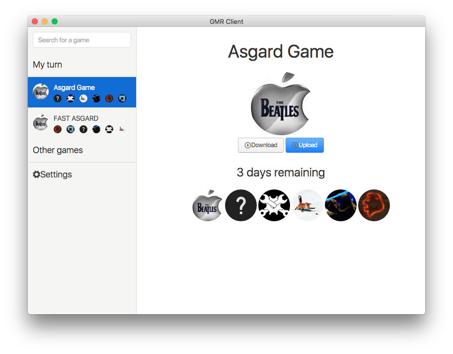

# GMR Client



A [Giant Multiplayer Robot](http://multiplayerrobot.com/) GUI client, for OS X, Linux\* and Windows\*

You can download the app from here: https://github.com/quentinms/GMR-client/releases/download/v0.0.7/eGMR.app.zip  
In order to use it, you will need to get an authentication key from here: http://multiplayerrobot.com/Download

Build with [electron](http://electron.atom.io), [angular](https://angularjs.org) and [photon](http://photonkit.com). 

*Not tested yet

## TODO

* Better error handling (more info to the user)
* Fix copy/pasting issues in settings
* Up/Downloading indicator
* Prettier Settings tab
* Players name display

## Dev

```
$ npm install
```

### Run

```
$ npm start
```

### Build

```
$ npm run build
```

Builds the app for OS X, Linux, and Windows, using [electron-packager](https://github.com/maxogden/electron-packager).

## License

MIT © Quentin Mazars-Simon
